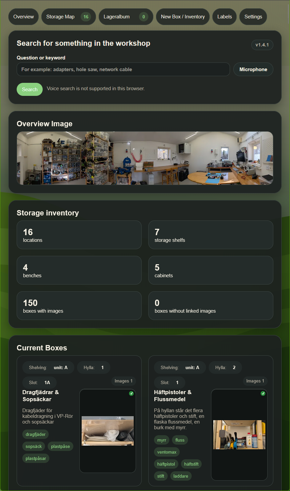
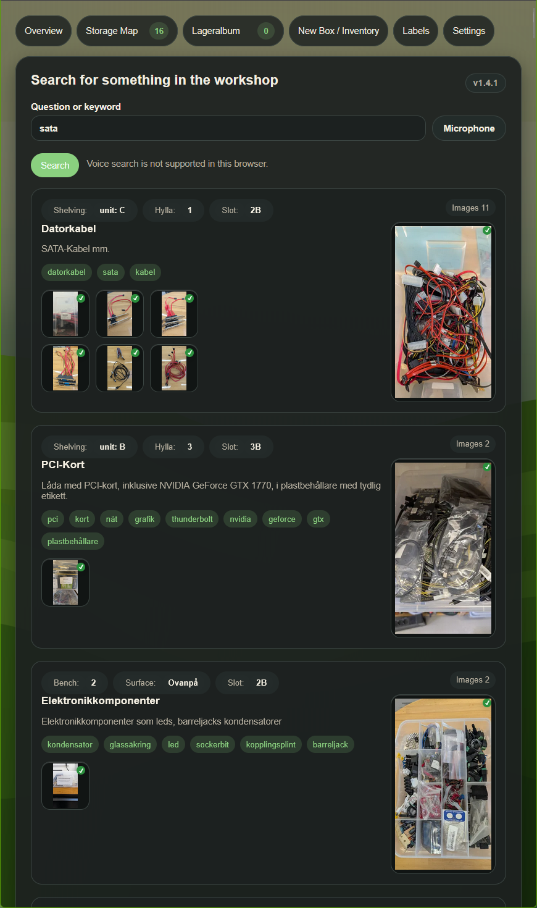
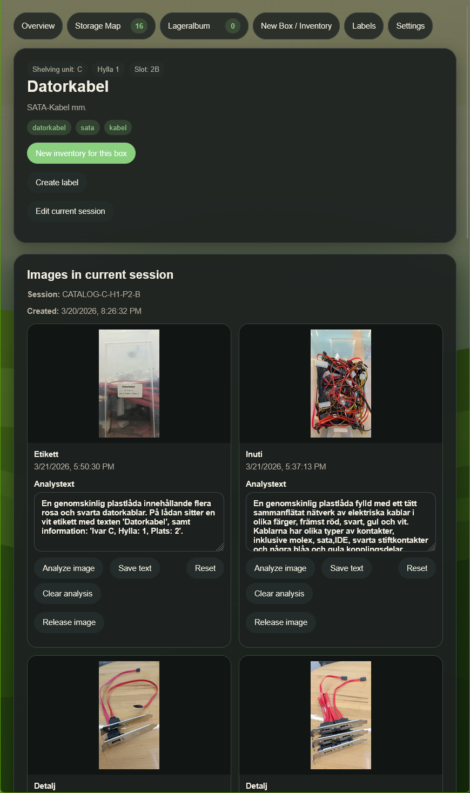
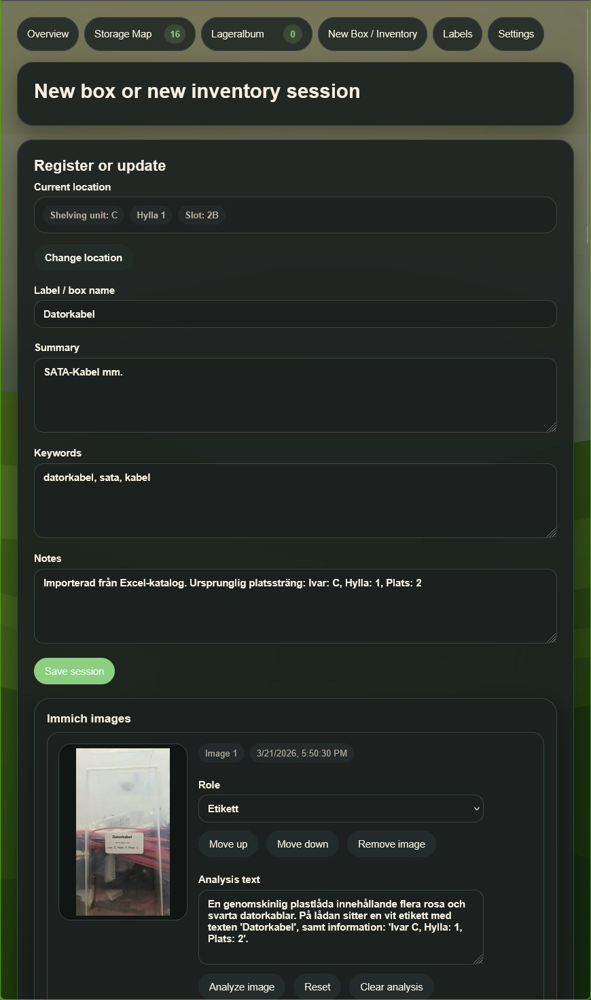
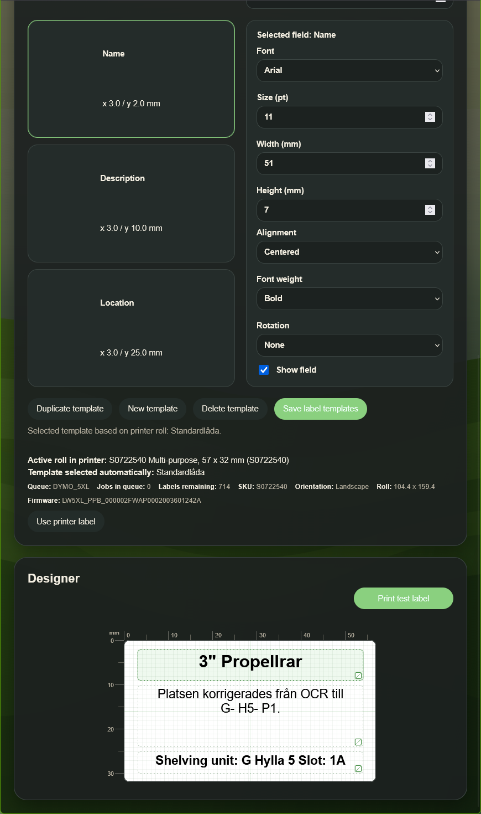

# Storage System

Practical day-to-day usage is described in [MANUAL.md](./docs/MANUAL.md). This README is the technical overview.

Planned next steps are collected in [TODO.md](./docs/TODO.md).

Current version: `v1.4.2`

A web app for inventorying workshop / shed / house boxes and storage places with an album-based photo source, JSON as the data store, and AI assistance for recognizing labels, contents, and likely box/location matches.

The app is built around a practical workflow:

1. photograph boxes with your phone
2. let the photos land in a shared album in Immich or PhotoPrism
3. connect the photos to the correct box in the app
4. let AI suggest label, location, contents, and photo roles
5. search later for the items you need to find

Since `v1.1.x`, the app is no longer limited to shelves only and now covers a broader storage structure:

- `Shelving unit`
- `Bench`
- `Cabinet`

For supporting documentation, see [docs/README.md](./docs/README.md).

## Screenshots

### Overview

The home page combines search, storage statistics, and the album cover based overview image.

### Search Results

Search results show matching boxes with their current location, summary, keywords, and linked photos. Where a linked image already has saved analysis text, hover effects can reveal that text directly from the image card. A small green checkmark on an image means analysis text is already saved for that image.

### Box View

The box page brings together the current session, linked photos, per-photo analysis, and history for a single box. Images that already have saved analysis text also expose it through hover overlays in the places where that preview is available. A small green checkmark on an image indicates that analysis text exists for that image.

### Edit Box

Existing boxes can be updated in place, including text, keywords, photo roles, and location changes when needed.

### Labels

The labels view supports template-based label generation, printer selection, and DYMO-oriented workflows.

## Overview

The system separates four identities:

- `boxId`: the physical box
- `currentLocationId`: where the box is currently stored
- `sessionId`: one inventory event
- `immichAssetId`: the linked image asset from the configured photo source

That makes it possible to:

- move a box without losing history
- update contents through a new session
- attach multiple photos to the same session
- keep several small boxes at the same physical position, for example `A`, `B`, `C`

The location model is now generic and supports several types of storage units:

- `Shelving unit`
- `Bench`
- `Cabinet`

That means the same inventory model works for shelves, workbenches, and cabinets.

`immichAssetId` is still the historical internal field name in the JSON data model. With `Immich` it stores the Immich asset ID, and with `PhotoPrism` it stores the PhotoPrism photo UID.

## Technology

- `Next.js 15` with App Router
- `React 19`
- `TypeScript`
- `Zod` for validation
- `Immich` or `PhotoPrism` as image source
- `data/inventory.json` as inventory database
- `data/app-settings.json` for user settings

## Data Files

### `data/inventory.json`

Contains three main lists:

- `boxes`
- `sessions`
- `photos`

In practice the model works like this:

- a box has one current location
- a box can have multiple sessions over time
- a session can have many photos

The internal photo roles are:

- `label`
- `location`
- `inside`
- `spread`
- `detail`

Location IDs can use both older and newer formats:

- `A-H2-P3-A` for older shelving unit locations
- `BENCH:LATHE:TOP:P1:A` for bench surfaces
- `CABINET:3D-PRINT:H2:P1:A` for cabinet locations

### `data/app-settings.json`

Contains everything that can be changed from the `Settings` page, including:

- theme
- font
- text size
- reduced motion
- selected photo source, account/access token details, and album
- AI provider and model
- analysis prompts
- printer queue selection for label printing

## Photo Source Requirements

The app is built around one selected album, not around arbitrary loose images from the whole library.

That means you need:

- an album in the configured photo source that contains the images the app should inventory from
- the selected album ID
- credentials that can read that album

For the current feature set:

- `Immich`: a shared album plus `shareKey` is enough
- `PhotoPrism`: use an app password, API key, or access token with album access

At the moment the app only needs read access in order to:

- list the selected album
- read the album assets
- use the album cover as the overview image
- fetch thumbnails and originals for linked assets

So creating a dedicated Immich user is optional right now.

Using an Immich `apiKey` is still supported and may become more useful later if the app gains broader album management or write-back features, but it is not required for the current album-based workflow.

PhotoPrism support currently follows the same album-based read workflow, but uses token-based access rather than an Immich-style share key.

## Key Pages

### `Overview`

The start page is primarily used for search.

It shows:

- a text or voice search box
- `Overview image` from the selected album cover, openable in its own lightbox
- box cards with location, summary, keywords, and photos
- all linked photos for each box in search results
- statistics for storage units, storage types, and box image coverage
- the current app version directly in the overview

Boxes in the overview are sorted in physical order:

- first `Shelving unit`
- then `Bench`
- finally `Cabinet`
- within each unit, boxes are sorted by location order

Search uses:

- box names
- location
- box notes
- session summary
- session notes
- keywords
- per-photo analysis text

Search is also more tolerant than before and handles:

- hyphenated terms such as `rc-car`
- short typos such as `cr-car`
- simple synonym variants such as `radio controlled` and `rc`

### `Storage Map`

The page is called `Storage Map` in the UI and shows all storage units in the system, for example `Shelving unit C`, `Bench Lathe`, or `Cabinet 3D Print`.

Here you can:

- open a storage unit
- see boxes grouped by shelf or surface
- click directly on a box to open the box page
- see the visual shelf structure for each shelving unit

Shelving units now have a more physical shelf view with:

- continuous side posts
- shelf boards
- shelf labels placed directly on the shelf
- only the positions that are actually used on each shelf

### `Images to Connect`

Shows only images from the selected album that are not yet linked to any box.

Here you can:

- select multiple images
- run overview analysis
- let AI suggest a box name, location, and contents
- get suggested photo roles and photo order
- connect directly to a likely existing box
- move to the registration page with prefilled data

The selected album cover is used as the `Overview image` on the start page and is therefore excluded from this view.

The same album cover is also excluded when you edit an existing box or add more images from the album later.

### `New Box / Inventory`

This page is used to register a new box or update an existing session.

Here you can:

- choose or change the current location first
- review and adjust box name, summary, and keywords
- choose a location category: `Shelving unit`, `Bench`, `Cabinet`
- write notes and save the session directly below `Keywords`
- change photo roles and photo order
- analyze individual photos directly
- edit or clear per-photo analysis text
- let selected album images follow automatically when saving, even without first clicking `Add selected images`
- save the session and return to the overview

When creating a completely new box, the app now also protects against accidentally overwriting an existing box at the same exact location. Saving is blocked and you must choose another letter or edit the existing box instead.

For existing boxes, you can also click `Change location` to move the box in the system without losing history.

Older inventory data may still contain location IDs without the final letter variant. The app now handles such boxes safely during editing, and the included migration script can normalize those stored locations.

### `Box View`

Shows a single box with:

- current summary
- all photos in the current session
- per-photo analysis
- history
- the ability to add more unassigned photos
- the ability to release a wrongly linked photo

Per-photo analysis now always uses unique photo IDs within each session, which prevents analysis editors from accidentally sharing state between photos.

### `Settings`

Here you can change:

- theme: `auto`, `light`, `dark`
- font: `Arial`, `System UI`, `Verdana`, `Trebuchet`, `Georgia`
- font size
- reduced motion
- photo source provider and base URL
- account label
- active album
- AI provider and model
- prompts that guide the model
- cleanup phrases and filters for AI responses
- backup download
- catalog export to Excel
- catalog import from an exported Excel file
- label printer queue from already installed CUPS queues
- language selection for the app UI
- access to the translation tool for editing language files in place
- separate translation AI configuration and translation prompt

For `Immich`, the app supports two access modes:

- `shareKey`: recommended when you only want to expose one shared album to the app
- `apiKey`: optional broader account-based access for future expansion

For `PhotoPrism`, the current implementation uses token-based access via app password / access token.

### `Translations`

The translation tool is available from `Settings`.

It currently supports:

- selecting source and target languages
- editing translations by section instead of loading every string at once
- searching and filtering by missing or changed strings
- creating a new language file from the UI
- exporting the current language JSON file
- per-language coverage tracking
- separate AI configuration for translation drafts
- a dedicated translation instruction prompt

Translation drafts can use a different AI model than image analysis, which is especially useful when comparing OpenRouter models for translation quality.

When the draft flow is used for `missing` strings, only the actually missing keys are now sent to the AI model.

## Labels and DYMO

The label system currently has first-class support for DYMO workflows:

- template-based label generation
- visual label designer
- direct printing through CUPS on Linux
- printer status reading
- active label roll detection
- remaining label count for supported DYMO devices
- visible remaining-label status in both the detailed printer metadata and the top printer status line
- selection of the active printer queue from installed CUPS queues in `Settings`

The app can now choose among installed CUPS queues, but DYMO queues are still the recommended option until A4 sheet label support is added.

## Public API

The app exposes public REST endpoints for integrations such as Home Assistant:

- `/api/public/health`
- `/api/public/search`
- `/api/public/ask`
- `/api/public/boxes/:boxId`

The public API can be protected with `LAGERSYSTEM_API_KEY`.

## Local Development

For local development and troubleshooting, see [LOCAL-TESTING.md](./docs/LOCAL-TESTING.md).

## Deployment and Integrations

- DYMO + CUPS setup: [deploy/DYMO_CUPS.md](./deploy/DYMO_CUPS.md)
- Home Assistant integration: [deploy/HOME_ASSISTANT.md](./deploy/HOME_ASSISTANT.md)
- Additional project documentation: [docs/README.md](./docs/README.md)
